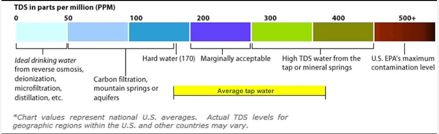

# Analog TDS Sensor for Arduino

[Analog TDS Sensor/ Meter for Arduino SKU:SEN0244 Brand:DFRobot](https://www.dfrobot.com/product-1662.html)

Used for our [Grow System](https://github.com/users/jwilleke/projects/2) within the [Nutrient-Tank](https://github.com/jwilleke/Nutrient-Tank)

## INTRODUCTION

Gravity: Analog TDS Sensor/Meter for Arduino is an Arduino-compatible TDS Meter Kit for measuring TDS value of the water, to reflect the cleanliness of the water. TDS meter can be applied to domestic water, hydroponic and other fields of water quality testing. You may also check Liquid Senser Selection Guide to get better familiar with our liquid sensor series.

TDS (Total Dissolved Solids) indicates that how many milligrams of soluble solids dissolved in one liter of water. In general, the higher the TDS value, the more soluble solids dissolved in water, and the less clean the water is. Therefore, the TDS value can be used as one of the references for reflecting the cleanliness of water.

TDS pen is widely used equipment to measure TDS value. The price is affordable, and it is easy to use, but it is not able to transmit data to the control system for online monitoring to do some water quality analysis. The professional instrument has high accuracy and can send data to the control system, but the price is expensive for ordinary people. To this end, we have launched an analog TDS sensor kit that is compatible with Arduino, plug, and play, easy to use. Matching with Arduino controller, you can build a TDS detector easily to measure the TDS value of liquid.
This tds sensor supports 3.3 ~ 5.5V wide voltage input, and 0 ~ 2.3V analog voltage output, which makes it compatible with a 5V or 3.3V control system or board. The excitation source is an AC signal, which can effectively prevent the probe from polarization and prolong the life of the probe, meanwhile, increase the stability of the output signal. The TDS probe is waterproof, it can be immersed in water for a long time measurement.

This tds meter can be used in water quality application, such as domestic water, hydroponics. With this product, you can easily DIY a TDS detector to reflect the cleanliness of water to protect your health.
If you want to make a simple water purifier, we recommend buying together with Gravity: Waterproof DS18B20 Sensor Kit

## Warning

- The probe can not be used in water above 55 degrees centigrade.
- The probe can not be left too close to the edge of the container, otherwise, it will affect the reading.
- The head and the cable of the probe are waterproof, but the connector and the signal transmitter board are not waterproof.

## FEATURES

- Wide Voltage Input: 3.3~5.5V
- Good Compatibility Output: 0~2.3V analog signal output, compatible with 5V or 3.3V controller
- AC Excitation Source: effectively prevent the probe from polarization
- Waterproof Probe
- Easy to Use: Arduino compatible, simple connection, plug, and play without soldering

## SPECIFICATION

- Signal Transmitter Board
- Input Voltage: 3.3 ~ 5.5V
- Output Voltage: 0 ~ 2.3V
- Working Current: 3 ~ 6mA
- TDS Measurement Range: 0 ~ 1000ppm
- TDS Measurement Accuracy: ± 10% F.S. (25 ℃)
- Module Size: 42 * 32mm
- Module Interface: PH2.0-3P
- Electrode Interface: XH2.54-2P

## TDS probe

- Number of Needles: 2
- Total Length: 83cm
- Connection Interface: XH2.54-2P
- Color: Black
- Other: Waterproof Probe

## DOCUMENTS

- [Product wiki](https://wiki.dfrobot.com/Gravity__Analog_TDS_Sensor___Meter_For_Arduino_SKU__SEN0244)
- [Analog_TDS_Sensor.cpp](/Hardware/Device%20Tests/Analog_TDS_Sensor.cpp)
