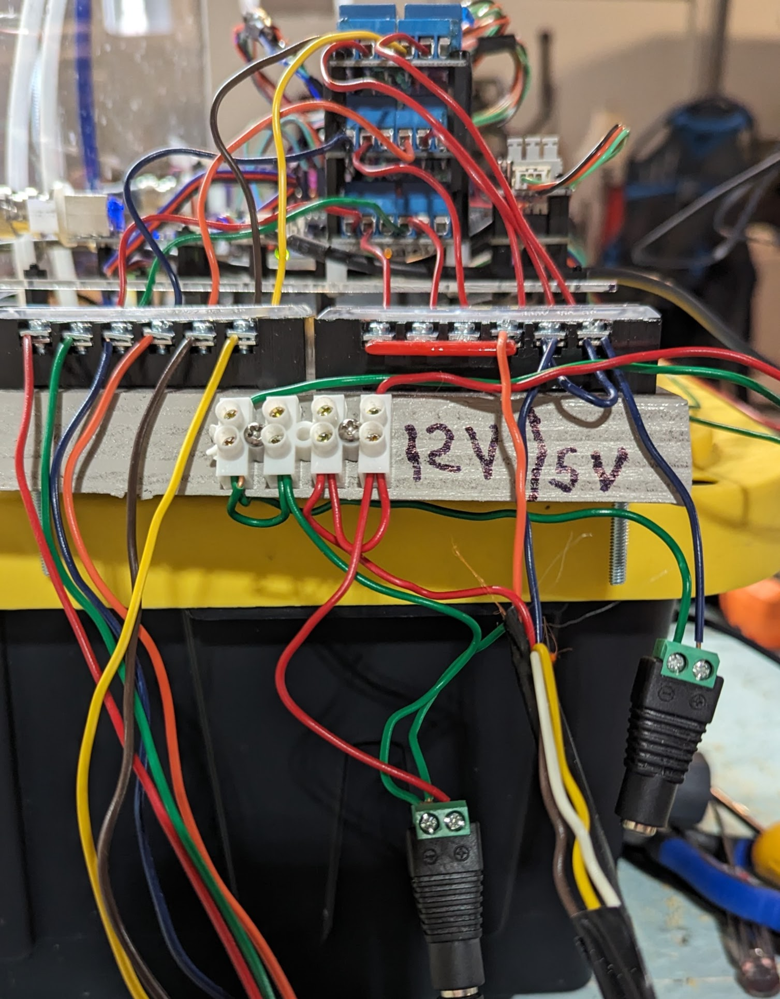

# Power Supplies

The intent was to use 12V power supply for the pumps and Stirrers. (FANs)

The inability to be able to control the [fan sppeds](https://github.com/jwilleke/ArduinoHA-examples/issues/3) has caused the need for a 5V power source also.

The Arduino will run on 5-27V.

## 5V and 12V DC Power

As we could not come up with a method to control the stirrers via PWM, we eneded up using 5V to power the stirrers.

## GND

GND it common across all entities including 12V, 5V and Arduino.

> Grow-Tent has as completly seperate pwoer source.

### 12V Supply

12V Supply supplies power to the following:

- Arduino main power source
- 12V and GND to Pumps and stirrers box.

The Pumps and stirrers box has a switch on the 12V supply that shuts off 12V so the pumps can be turrned off.

### 5V Supply

5V Supply powers sonly the stirrers.

## Cables

Two cables connect to the Nutrient Pumps and stirrers.

### Cable One

Cable 1 is a 7 conductor cable from the Conrtol Board to the Pump Container.

12 V is on this cable to power the verios motors in the Pump Container.

| Item | MACRO | IO PIN | Relay | Relay Pin | CABLE | Color |
|  --- | --- | --- | --- | --- | --- | --- |
| ph Up Pump | PHUP_SOLUTION_PUMP | 8 | 1 | 1 | 1 |RED |
| ph Down Pump | PHDOWN_SOLUTION_PUMP | 9 | 1 | 4 | 1 | GREEN |
| A1 Pump |A1SOLUTION_PUMP | 10 | 2 | 1 | 1 | PURPLE |
| A2 Pump | A2SOLUTION_PUMP | 11 | 2 | 4 | 1 | ORaNGE |
| STIRER 1 Group | SOLUTION_STIRER_1 | 12 | 3 | 1 | 1 | BROWN |
| STIRER 2 Group | SOLUTION_STIRER_2 | 13 | 3 | 4 | 1 | YELLOW |

> White wire is NOT used.

## Cable Two

Cable 2 supplies 12V, 5V and GND to the the Pump Container.

- Red is 12V+
- Green is GRN
- Blue is 5V+
- Orange is 12V+ switched from Pumps and stirrers box
- Other Wires of this cable could be made in the future
